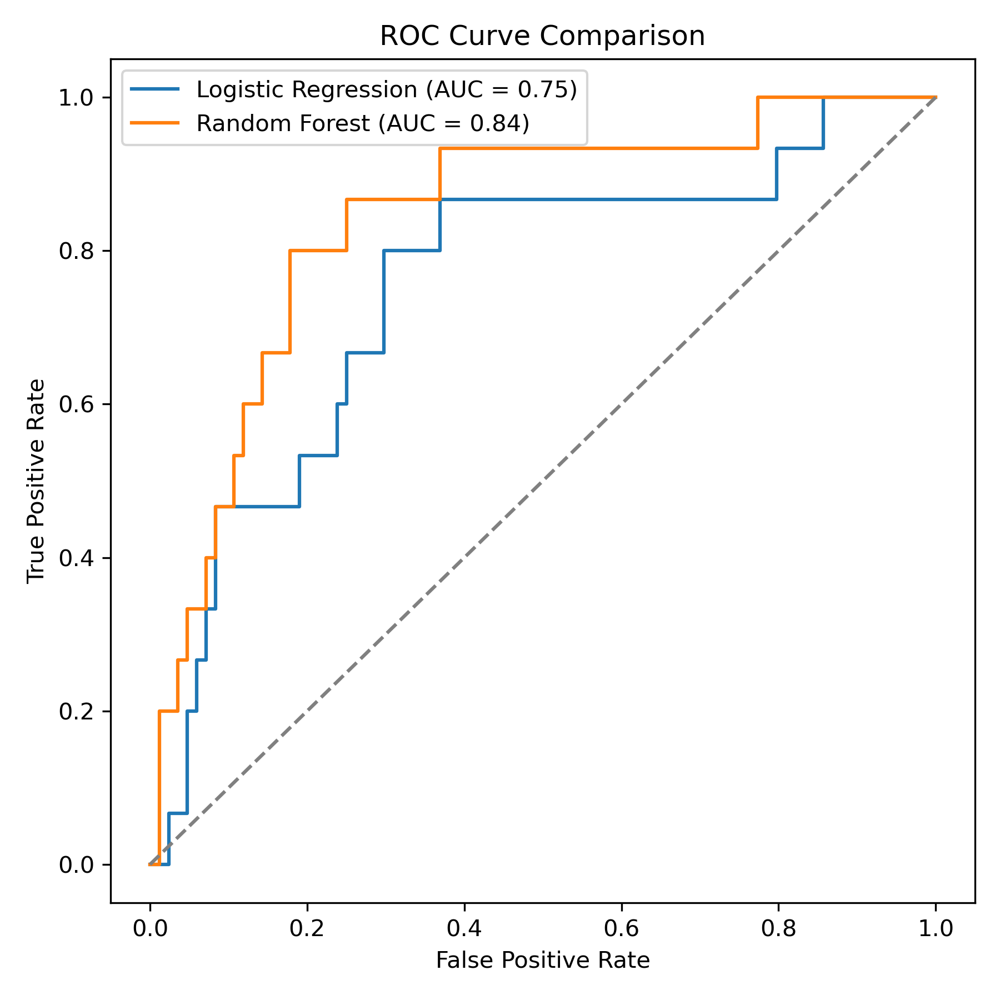
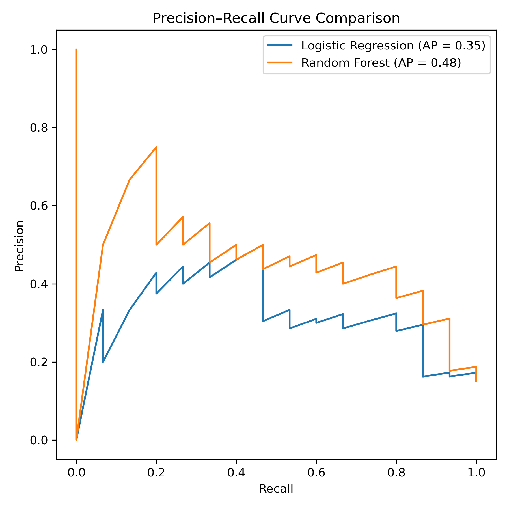

# Diabetes Onset Prediction Using EHR Lab Data

## Project Overview

This project uses real-world electronic health record (EHR) laboratory data to predict the risk of **future diabetes onset**.  
The goal is to identify patients early so that preventative care and timely intervention can be prioritized.

Using patient-level lab trends and clinical measurements, I built and evaluated machine learning models to classify diabetes risk.

---

## Key Objectives

- Predict diabetes onset using structured lab data  
- Engineer meaningful longitudinal features (mean values, last recorded values, missingness patterns)  
- Compare interpretable and non-linear models  
- Optimize recall to minimize missed high-risk patients  

---

## Dataset & Feature Engineering

Patient records were transformed into a **one-row-per-patient modeling table** using aggregated lab features such as:

- BMI, heart rate, BUN (renal marker)
- Days since last recorded lab
- Lab frequency counts
- Missingness indicators for incomplete lab panels

Final dataset:

- **396 patients**
- **~40 engineered features**
- Binary outcome: diabetes onset (15% positive class)

---

## Models Implemented

Two supervised learning models were trained and compared:

### Logistic Regression (Baseline)
- Interpretable coefficients  
- Strong recall performance  
- Sensitive to correlated features

### Random Forest Classifier
- Captures non-linear patterns  
- Improved precision while maintaining high recall  
- Feature importance driven by impurity reduction

---

## Model Evaluation

#### ROC Curve Comparison


#### Precision-Recall Curve


Because diabetes onset is a high-stakes outcome, evaluation focused on **recall-first threshold tuning**.

### Best Performance (Random Forest)

- ROC AUC: **0.84**
- Recall (Diabetes class): **0.87**
- Precision improved from **0.19 → 0.37** vs Logistic Regression at threshold = 0.3

Threshold adjustment was used to balance:

- Minimizing false negatives (missed diabetics)
- Controlling false positives

---

## Key Insights

- Longitudinal lab recency features (`days_since_last`) were among the strongest predictors  
- Random Forest generalized better under class imbalance  
- Missing lab panels carried predictive signal and were retained as features  

---

## Tools & Libraries

- Python, Pandas, NumPy  
- Scikit-learn  
- Matplotlib / Seaborn  
- Jupyter Notebook  

---

## Repository Structure

```bash
├── Notebooks/
│   ├── 01_Data_Pull.ipynb
    ├── 02_Data_Cleaning.ipynb
│   ├── 03_EDA.ipynb
│   ├── 04_Feature_engineering.ipynb
│   ├── 05_Modeling.ipynb
│   └── 06_Evaluation.ipynb
│
├── Data/
│   ├── Raw/
│   └── Cleaned/
│
├── Artifacts/
│   ├── Models/
    ├── Metrics/
│   └── Predictions/
│
└── README.md
